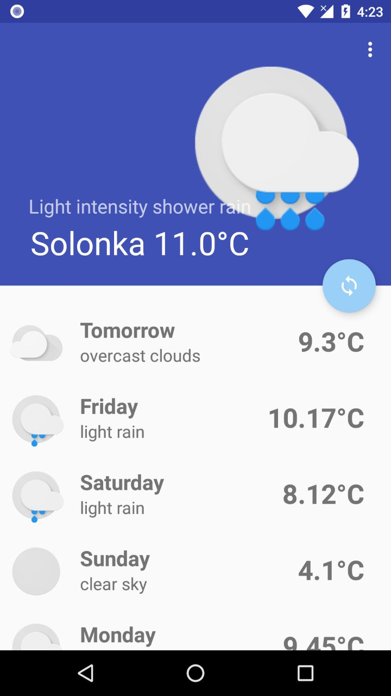

 
 
 
# Coffee Weather 

 - This is a Hackathon project for BestHackaton 2017, Lviv, Ukraine
 

  
[Download Coffee Weather](CoffeeWeather.apk)

You can use the app to get curren weather near of your location, as well as fore cast for foreseeable future!

### Installation
git clone and build it or with Android Studio.. wait for it on Play Store!

## Team

 
 

 

  
   
  

 

### Todos

 - Better Weather
 - More Sun for everyone!
 

MIT

**Free Software, Hell Yeah!**

[//]: # (These are reference links used in the body of this note and get stripped out when the markdown processor does its job. There is no need to format nicely because it shouldn't be seen. Thanks SO - http://stackoverflow.com/questions/4823468/store-comments-in-markdown-syntax)

